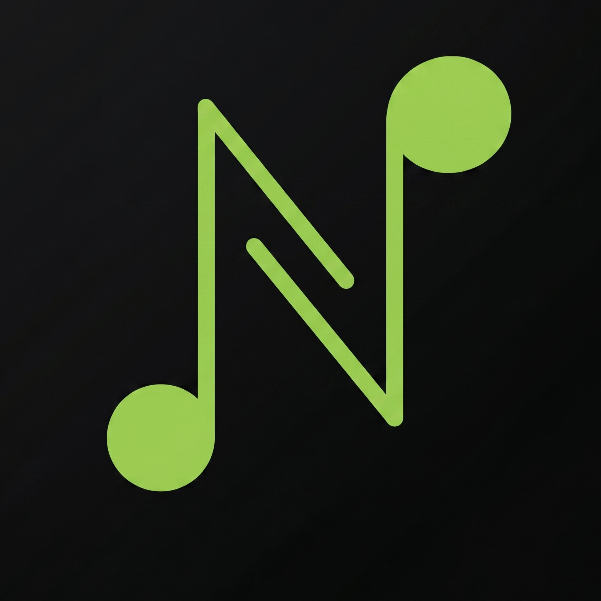

# Noctune



A local-first desktop music player with Spotify-powered discovery, YouTube stream playback, smart autoqueue, and background prefetching.

[](https://react.dev/)
[](https://www.typescriptlang.org/)
[](https://vite.dev/)
[](https://tailwindcss.com/)
[](https://nodejs.org/)
[](https://fastify.dev/)
[](https://www.rust-lang.org/)
[](https://tauri.app/)
[](https://www.sqlite.org/)
[](https://github.com/yt-dlp/yt-dlp)
[](https://developer.spotify.com/documentation/web-api/)

Noctune uses Spotify for clean metadata and discovery, then maps tracks to YouTube streams through a scoring-based matcher. Playback stays fast by learning from previous plays, refreshing expired audio URLs, and prefetching upcoming tracks before they are needed.

## Features

- **Spotify metadata search** for clean titles, artists, durations, and artwork.
- **YouTube stream playback** through `yt-dlp`, with no permanent audio downloads.
- **Spotify-to-YouTube matching** with scoring for official/topic channels, duration accuracy, and penalties for reaction, cover, karaoke, remix, live, and unrelated uploads.
- **Smart autoqueue** seeded from the selected track, instead of blindly queueing raw search results.
- **Background prefetch** for upcoming tracks so next/skip playback feels instant.
- **Cache learning** for resolved tracks and fresh audio URLs.
- **Cache import/export** as JSON from Settings.
- **Playlist storage** with SQLite.
- **Desktop shell** powered by Tauri.

## Tech Stack

| Layer | Tech |
|---|---|
| Desktop shell | Tauri 2 |
| Frontend | React 18, Vite, Tailwind CSS |
| State | Zustand, TanStack Query |
| Backend | Fastify, TypeScript |
| Playback resolver | yt-dlp-wrap |
| Queue workers | p-queue |
| Playlist DB | SQLite via better-sqlite3 |
| Runtime cache | JSON files in `backend/data/` |

## How It Works

```text
Search query
  -> Spotify metadata search
  -> user chooses a seed track
  -> autoqueue generates related candidates
  -> prefetch maps candidates to YouTube with scoring
  -> yt-dlp resolves stream URLs
  -> cache stores metadata + URL expiry
  -> next track can play from prefetch/cache
```

The search UI returns quickly because YouTube matching is not done during typing/search. Matching and stream resolving happen later in the prefetch path.

## Matching Strategy

Noctune ranks YouTube candidates with lightweight heuristics:

- bonus for official audio/video, official channels, Topic channels, and VEVO-style channels
- bonus for close duration matches
- penalty for reaction, review, cover, karaoke, instrumental, remix, sped-up, slowed, nightcore, live versions, and fan-upload signals
- cache for Spotify-to-YouTube mappings so future runs are faster

## Setup

Install dependencies:

```bash
npm install
```

Install `yt-dlp` separately:

```bash
# macOS
brew install yt-dlp

# Linux
pip install yt-dlp

# Windows
winget install yt-dlp
# or if you use Chocolatey:
choco install yt-dlp
# or just look up the download on the web i guess
```

Optional Spotify search requires a Spotify developer app client ID and secret. Add them from the app Settings screen.

## Running

```bash
# Backend + frontend in browser
npm run dev

# Frontend only
npm run dev:frontend

# Backend only
npm run dev:backend

# Production build
npm run build
```

For the Tauri desktop shell:

```bash
npm run tauri
```

## Project Structure

```text
noctune/
  backend/
    src/
      routes/          Fastify API routes
      services/        cache, Spotify, yt-dlp, matcher, prefetch, playlists
      types/           shared backend domain types
    data/              local runtime data, ignored by git
  frontend/
    src/
      components/      app UI
      hooks/           audio engine bridge
      store/           Zustand player state
      utils/           typed API client
  src-tauri/           Tauri desktop shell
```

## Local Data

Runtime data is stored under `backend/data/` and ignored by git:

- `config.json` - local settings and Spotify credentials
- `songs.json` - learned track/cache data
- `spotify-youtube-map.json` - Spotify-to-YouTube mapping cache
- `muzikku.db` - playlist database

Use Settings -> Cache Learning to export, import, or clear cache JSON.

## GitHub Repository Description

Local-first desktop music player with Spotify discovery, YouTube stream playback, smart autoqueue, cache learning, and background prefetch.

## License

[MIT](./LICENSE)
